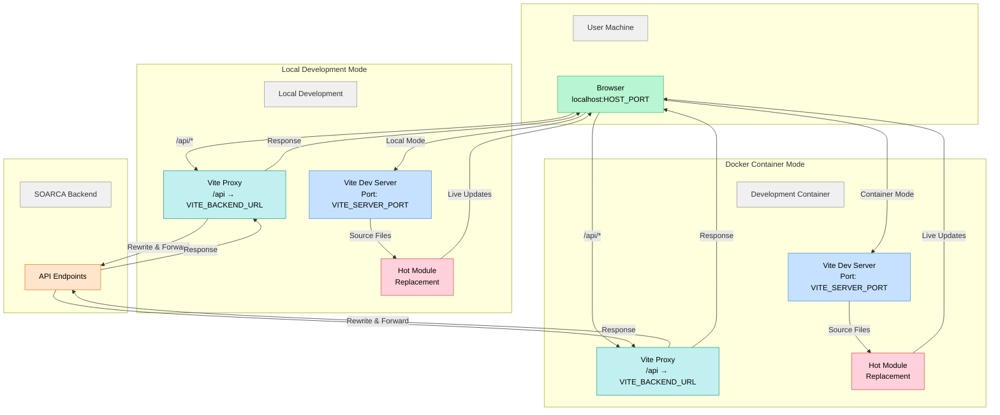
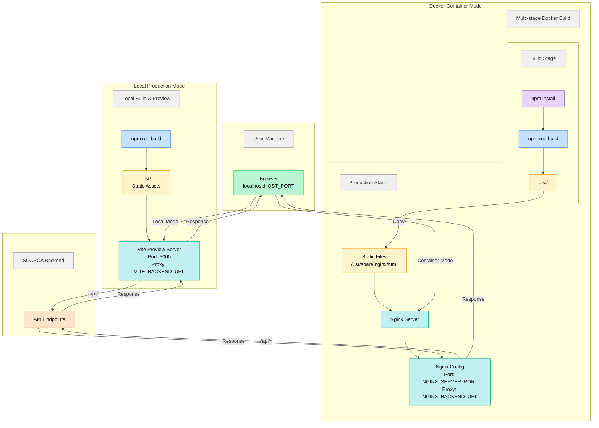

<div align="center">
<a href="https://cossas-project.org/cossas-software/soarca">
</div>

# SOARCA-GUI

[](https://cossas.github.io/SOARCA/docs/)
[](https://github.com/cossas/soarca-gui/releases)
[](https://github.com/COSSAS/SOARCA/actions)
[](https://opensource.org/licenses/Apache-2.0)

Modern [React](https://react.dev) + [Vite](https://vitejs.dev) frontend for the [SOARCA](https://github.com/COSSAS/SOARCA) platform, providing a lightweight UI to interact with SOARCA services. The app uses [TypeScript](https://www.typescriptlang.org/), [styled-components](https://styled-components.com/) for theming, [React Router](https://reactrouter.com/) for navigation, and [React Query](https://tanstack.com/query) for data fetching.

> [!WARNING]
> SOARCA-GUI is still in development and features and look may change with time.

## Requirements

- [Node.js](https://nodejs.org/) 20+ (if runned locally)
- [npm](https://www.npmjs.com/) 10+ (if runned locally)
- [Docker](https://www.docker.com/) and [Docker Compose](https://docs.docker.com/compose/) (for building/running from docker image)

## Running the Project

### Development Mode

Development mode provides hot-reload capabilities and a proxy server for API requests to the SOARCA backend. In order to provide an enjoyable development experience, we provide both a local environment and a Docker setup. In order to accomodate both scenarios and provided minimal user configuration needed, we opted for the architecture shown below.

#### Development Architecture

Development can happen in two ways: locally running Vite on your machine or in a Docker container.



**Environment variables involved:**

- `VITE_BACKEND_URL` - Backend API URL (proxied by Vite dev server)
- `VITE_SERVER_PORT` - Port where Vite dev server listens
- `DOCKER_HOST_PORT` - The port of the host machine that is mapped to the `VITE_SERVER_PORT` of the Vite dev server running in the container. This is only relevant when running the Development Container.
- `HOST_PORT` - is the same of the `VITE_SERVER_PORT` if run locally or `DOCKER_HOST_PORT` if running the Development Container.

#### Running Locally (recommended for development)

1. **Install (dev)dependencies:**

   ```bash
   npm install -D
   ```

2. **Configure environment variables:**
   Optionally create a `.env` file (explanation and defaults can be found in `.env.example`). Vite will load `*.env` files for the active mode and only expose variables that begin with `VITE_` to the browser (see https://vite.dev/guide/env-and-mode).

   If no enviroment variables are provided, the defaults are:
   - `VITE_BACKEND_URL`: `http://localhost:8080` - (SOARCA default)
   - `VITE_SERVER_PORT`: `5713` - (Vite default)

3. **Start the dev server:**

   ```bash
   npm run dev
   ```

   The app will be available at `http://localhost:HOST_PORT` with hot-reload enabled. You will see in the terminal where exactly the app is being served.

#### Running in Docker Container (reccomended for development without Node/npm setup)

1. **Configure environment variables:**
   Optionally provide values via the shell, a project `.env`, or `--env-file` when starting Compose (explanation and defaults can be found in `.env.example`).

   If no enviroment variables are provided, the defaults are:
   - `VITE_BACKEND_URL`: `http://host.docker.internal:8080` - (The `localhost:8080` equivalent of the Container internal network)
   - `VITE_SERVER_PORT`: `5173`
   - `DOCKER_HOST_PORT` — port on the host mapped to the `VITE_SERVER_PORT` (default: `5173`)

2. **Start the container:**
   ```bash
   docker compose -f docker-compose.dev.yml up
   ```
   The app will be available at `http://localhost:HOST_PORT` with hot-reload enabled.

### Production Mode

Production mode builds optimized static assets and serves them via Nginx. We use this mode to publish Docker images and make releases, but it can be useful to run a production build locally through Vite as well by building the project locally and previewing it. Also this mode is supported for both local and Docker Container environment.
As before, a diagram of the architecture is shown down below.

#### Production Architecture

Production deployment can happen in two ways: locally using Vite's preview server or in a Docker container using Nginx.



**Environment variables involved:**

- `VITE_BACKEND_URL` - Backend API URL embedded into the client bundle at build time (must be set before running `npm run build`)
- `VITE_APP_VERSION` - Application version embedded into the client bundle at build time (optional, falls back to git describe or "development")
- `NGINX_BACKEND_URL` - Backend API URL used by Nginx at runtime to proxy `/api/*` requests. This is only relevant when running in Docker Container Mode.
- `NGINX_SERVER_PORT` - Port where Nginx listens inside the container. This is only relevant when running in Docker Container Mode.
- `DOCKER_HOST_PORT` - The port of the host machine that is mapped to the `NGINX_SERVER_PORT` of the Nginx server running in the container. This is only relevant when running in Docker Container Mode.
- `HOST_PORT` - Port 4173 (Vite default) for local preview mode (`npm run preview`) or `DOCKER_HOST_PORT` when running in Docker Container Mode.

#### Running Locally (recommended for preview)

1. **Install dependencies:**

   ```bash
   npm install
   ```

2. **Configure environment variables:**
   Optionally create a `.env` file (explanation and defaults can be found in `.env.example`). Note that `VITE_` variables must be set at _build time_ to be embedded into the static bundle.

   If no environment variables are provided, the defaults are:
   - `VITE_BACKEND_URL`: `http://localhost:8080` - (SOARCA default)

3. **Build and preview:**

   ```bash
   npm run build
   npm run preview
   ```

   The app will be available at `http://localhost:4173` (Vite preview server default).

   > [!WARNING]
   > For actual production deployment, use a proper web server like Nginx (see Docker section below).

#### Running in Docker Container (recommended for production)

1. **Configure environment variables:**
   Optionally provide values via the shell, a project `.env`, or `--env-file` when starting Compose (explanation and defaults can be found in `.env.example`). Note that `VITE_` variables are build-time only (embedded at image build), while `NGINX_` variables are runtime (used by the running container).

   If no environment variables are provided, the defaults are:
   - `VITE_BACKEND_URL`: `http://localhost:8080` - embedded at build time
   - `NGINX_BACKEND_URL`: `http://host.docker.internal:8080/` - used at runtime
   - `NGINX_SERVER_PORT`: `8081`
   - `DOCKER_HOST_PORT`: `8081` — port on the host mapped to the `NGINX_SERVER_PORT`

2. **Build and start the container:**

   ```bash
   docker compose up --build
   ```

   The app will be available at `http://localhost:DOCKER_HOST_PORT`.

### NPM Scripts for local run

- `npm run dev` - Start Vite dev server with hot-reload
- `npm run build` - Type-check and create production bundle
- `npm run preview` - Serve the production build locally (Vite preview server)
- `npm run lint` - Run ESLint
- `npm test` - Run unit tests (Vitest)

## Documentation

- Project docs: https://cossas.github.io/SOARCA/docs/
- Contribution guidelines: https://cossas.github.io/SOARCA/docs/contribution-guidelines/

## Quick Use

Usage of SOARCA-GUI is described here: https://cossas.github.io/SOARCA/docs/

## Contributing

Want to contribute to this project? Please keep in mind the following rules:

- This repository uses git **rebase** strategy
- For each PR, there should be at least one issue
- Make sure all tests pass (including lint errors)
