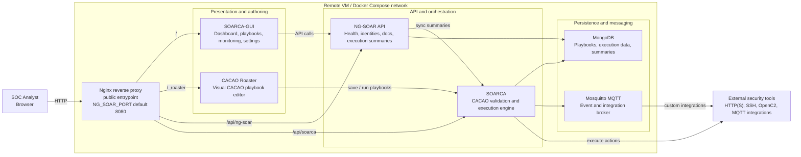

# NG-SOAR Presentation Architecture

Copyright (c) 2026 Cyentific AS. All Rights Reserved.

Use `ng-soar-presentation-architecture.svg` for slides. The Mermaid source below is an editable version of the same high-level runtime view.

Speaker note:

NG-SOAR exposes one browser-facing entrypoint through Nginx. The proxy routes the main UI, the embedded CACAO Roaster editor, the NG-SOAR platform API, and the SOARCA execution API. SOARCA is the orchestration engine, MongoDB stores playbooks and execution state, and Mosquitto supports asynchronous/custom integrations with external security tools.
